# Introduction

This page compiles the technical specifications of Tamagotchi toys, with focus on worldwide releases. This project is inspired by [this talk](https://www.youtube.com/watch?v=c4PkcZScBV8) by [Natalie Silvanovich](http://natashenka.ca) and her further work on Tamagotchis.

Check out the [GitHub repo](https://github.com/loociano/tamagotch) to contribute or report a broken link.

# Tamagotchi Original Series

* Versions: [P1 and P2](http://tamagotchi.wikia.com/wiki/Tamagotchi_(1996_Pet)), [Angel](http://tamagotchi.wikia.com/wiki/Tamagotchi_Angel) and [Ocean](http://tamagotchi.wikia.com/wiki/Tamagotchi_Ocean) 
* Release Dates: 1996-1998

## Specs

* CPU: 4-Bit CMOS E0C6S46 ([Datasheet](http://download.epson-europe.com/pub/electronics-de/asmic/4bit/62family/technicalmanual/tm_6s46.pdf))
* Clock Speed: 32.768 kHz
* Memory: 640x4 words (RAM) 160x4 words (display)

# Tamagotchi Connection Series

* Versions: [V1](http://tamagotchi.wikia.com/wiki/Tamagotchi_Connection_Version_1), [V2](http://tamagotchi.wikia.com/wiki/Tamagotchi_Connection_Version_2), [Mini](http://tamagotchi.wikia.com/wiki/Tamagotchi_Mini), [V3](http://tamagotchi.wikia.com/wiki/Tamagotchi_Connection_Version_3), [V4](http://tamagotchi.wikia.com/wiki/Tamagotchi_Connection_Version_4), [V4.5](http://tamagotchi.wikia.com/wiki/Tamagotchi_Connection_Version_4.5), [V5](http://tamagotchi.wikia.com/wiki/Tamagotchi_Connection_Version_5), [V5.5 (Celebrity)](http://tamagotchi.wikia.com/wiki/Tamagotchi_Connection_Version_5_Celebrity) and [V6 (Music Star)](http://tamagotchi.wikia.com/wiki/Tamagotchi_Music_Star)
* Release Dates: 2004-2009
* Tamagotchi Connection had a [Debug Mode](http://www.tamatalk.com/pixelmood/tamagotchi_connection_debugging.htm) that could be enabled only by disassembling. Debug mode allows character selection and making time run faster.


*Activating Debug Mode with a pencil ([source](http://www.tamatalk.com/pixelmood/tamagotchi_connection_debugging.htm))*

## Disassembly 

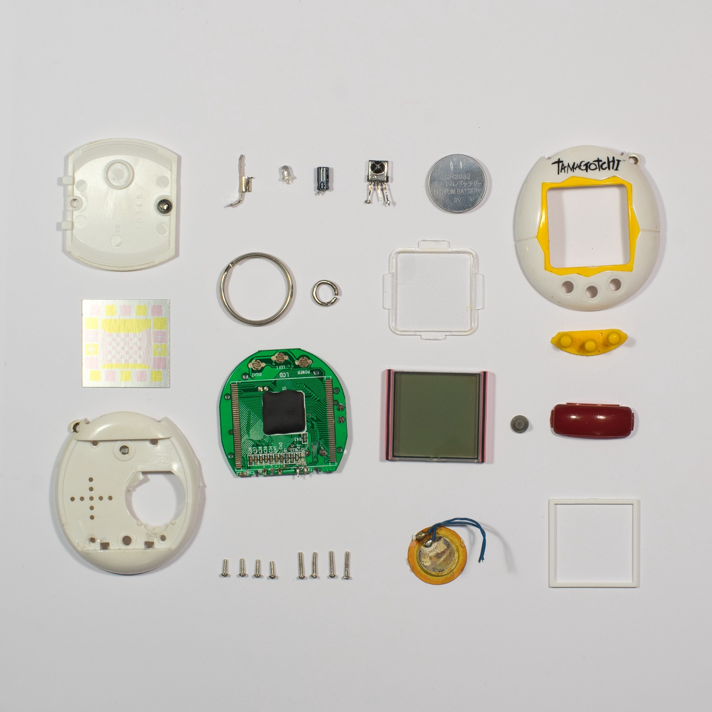
*Tamagotchi Connection disassembly ([source](https://artplusmarketing.com/another-icons-teardown-tamagotchi-original-322dc8ed188d))*

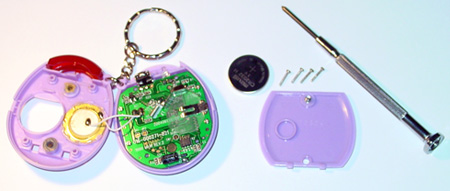
*Another Tamagotchi Connection disassembly ([source](http://www.tamatalk.com/pixelmood/tamagotchi_connection_debugging.htm))*

# Tamagotchi Mini

[Tamagotchi Mini](http://tamagotchi.wikia.com/wiki/Tamagotchi_Mini) was released in 2005 and re-launched worldwide in 2017 to celebrate Tamagotchi's 20th Anniversary. [Official Page (Japanese)](http://tamagotch.channel.or.jp/tamagotchi/mini).

## Tech Specs

* CPU: ?
* Memory: ?
* IO: 3 buttons, 16x16 pixel screen

## Disassembly

<p class="half-sized">
  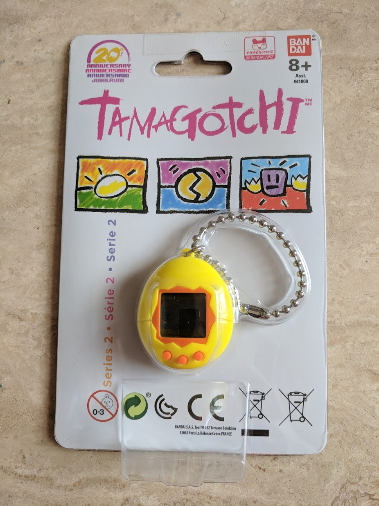
  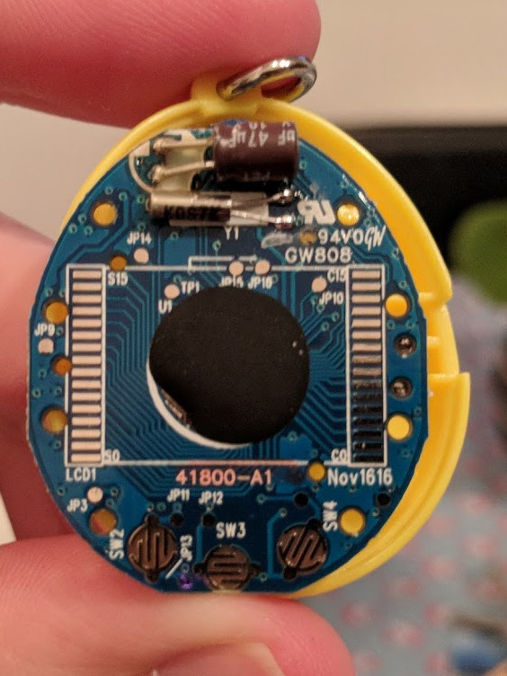
  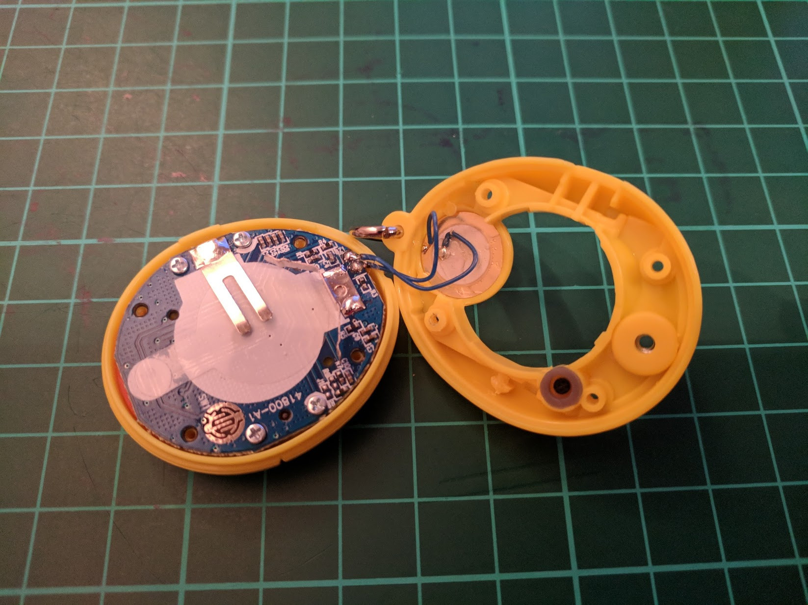
  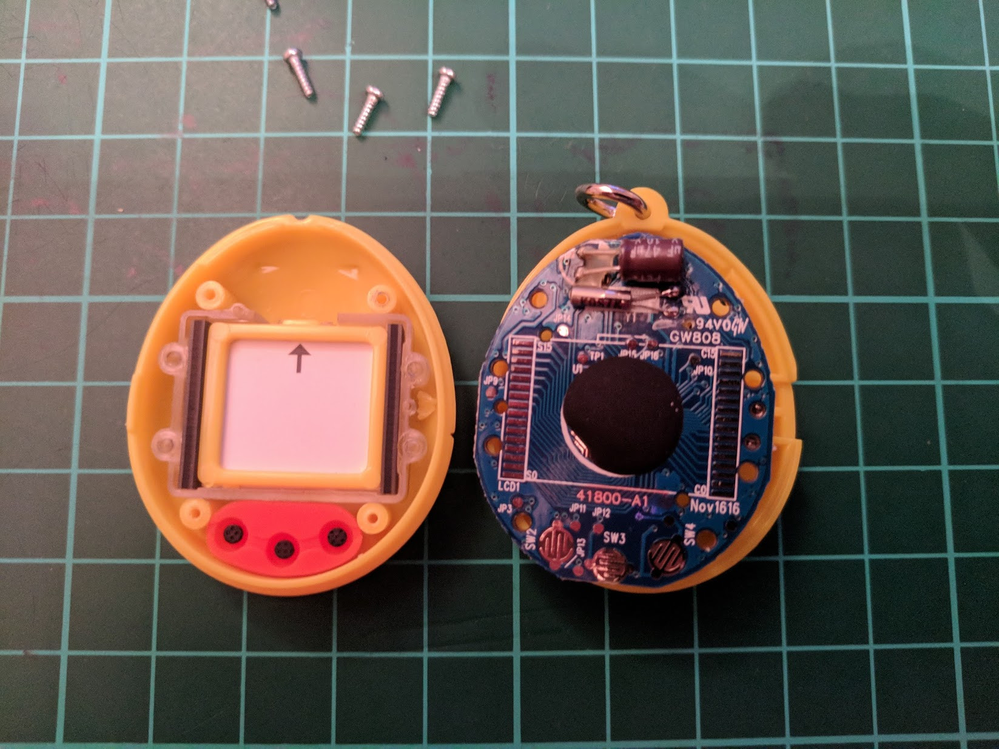
</p>

# TamaTown Tama-Go

[TamaTown Tama-Go](http://tamagotchi.wikia.com/wiki/TamaTown_Tama-Go) was released in 2010 and reverse engineered by [Natalie Silvanovich](http://natashenka.ca).

## Tech Specs

* CPU: 8-bit CMOS GPLB52320A ([datasheet](http://www.generalplus.com/doc/ds/GPLB52640A-52320A-51640A-51320AV19_ds.pdf)) with 2x 16-bit timers.
* RAM: 1,536 bytes
* ROM: 640K bytes = 20 banks of 32KB ([dump](https://github.com/natashenka/Tamagotchi-Hack/tree/master/codedump/rompages), [GP Test Program](https://github.com/natashenka/Tamagotchi-Hack/blob/master/codedump/GPTestProgram))
* IO: 16 ports PA[7:0], PB[7:0]
  * Serial Peripheral Interface (SPI)
  * Display Controller: 4 levels of gray with 512 bytes of dedicated RAM. 64 segments and 32 commons = 2048 pixels
* Sound Processing Unit (SPU)

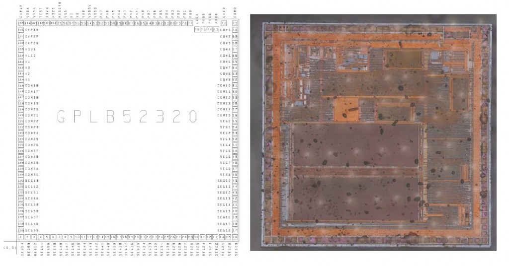
*GPLB52320A schematic and actual chip ([source](https://www.kwartzlab.ca/2011/06/tama-go-microcontroller))*

Tama-Go Figure

* ROM: GPR26LXXXX (8MB or 16MB)

## Memory Map

```
$0000-$0600 SPU RAM, GP RAM
$0600-$0FFF -
$1000-$1FFF DPRAM (VRAM)
$2000-$2FFF -
$3000-$3FFF IO Reg
$4000-$7FFF ROM bank (lower)
$8000-$BFFF ROM bank (high)
$C000-$CBBF SPU table, test program
$CBC0-$CBFF Test Interrupt Vector
$CC00-$FFBF ROM (33C0 bytes)
$FFC0-$FFEF Interrupt Vector
$FFF0-$FFF9 -
$FFFA-$FFFD NMI and reset vector
$FFFE-$FFFF -
```

## Disassembly

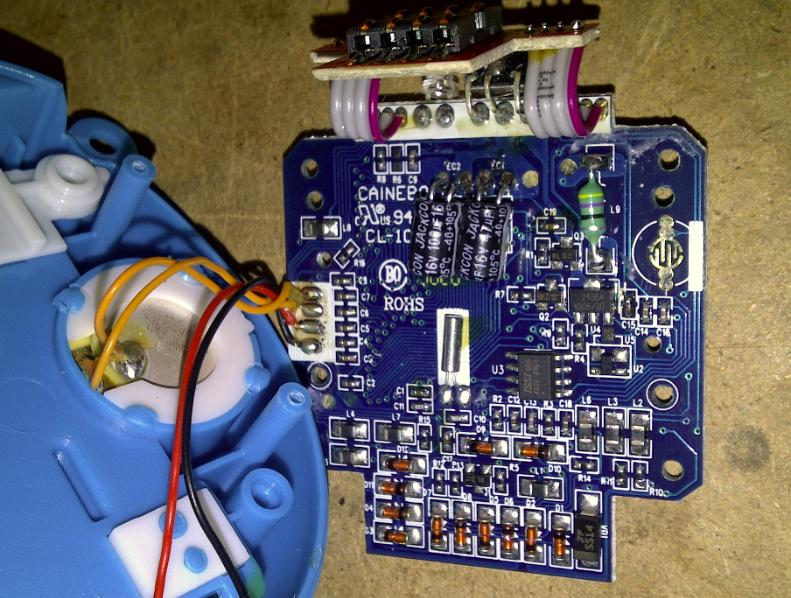
*TamaTown board ([source](https://www.kwartzlab.ca/2010/11/tama-town-tamago-teardown))*

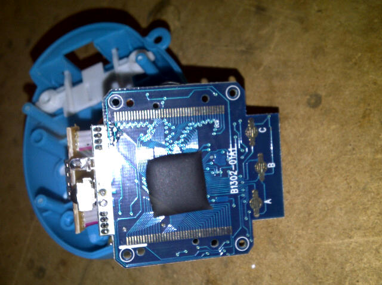
*TamaTown Tama-Go board, back side ([source](https://www.kwartzlab.ca/2010/11/tama-town-tamago-teardown))*

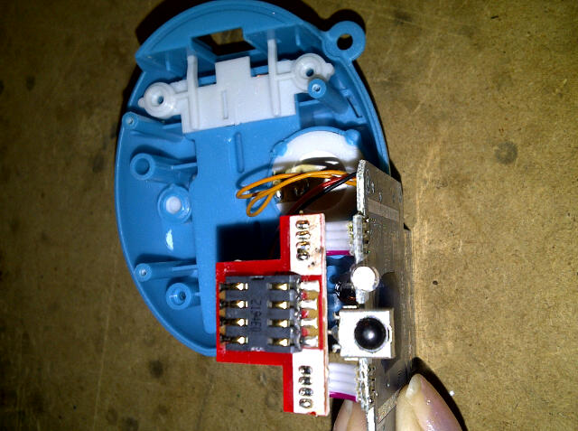
*TamaTown Tama-Go top board, for figure ([source](https://www.kwartzlab.ca/2010/11/tama-town-tamago-teardown))*

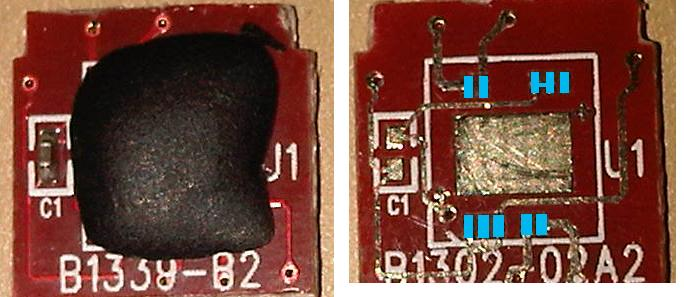
*TamaTown figure board with epoxy ([source](https://www.kwartzlab.ca/2010/11/tama-town-tamago-teardown))*

# Tamagotchi Friends Series

* Versions: [Tamagotchi Friends](http://tamagotchi.wikia.com/wiki/Tamagotchi_Friends) and [Tamagotchi Friends: Dream Town](http://tamagotchi.wikia.com/wiki/Tamagotchi_Friends:_Dream_Town_Digital_Friend)
* Release dates: 2014-2016

## Disassembly

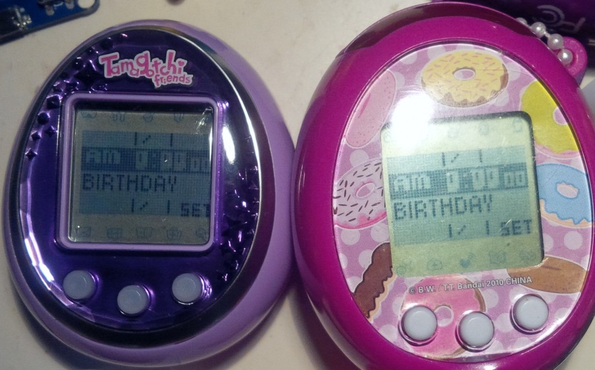
*Tamagotchi Friends ([source](http://natashenka.ca/tamagotchi-friends-teardown/))*

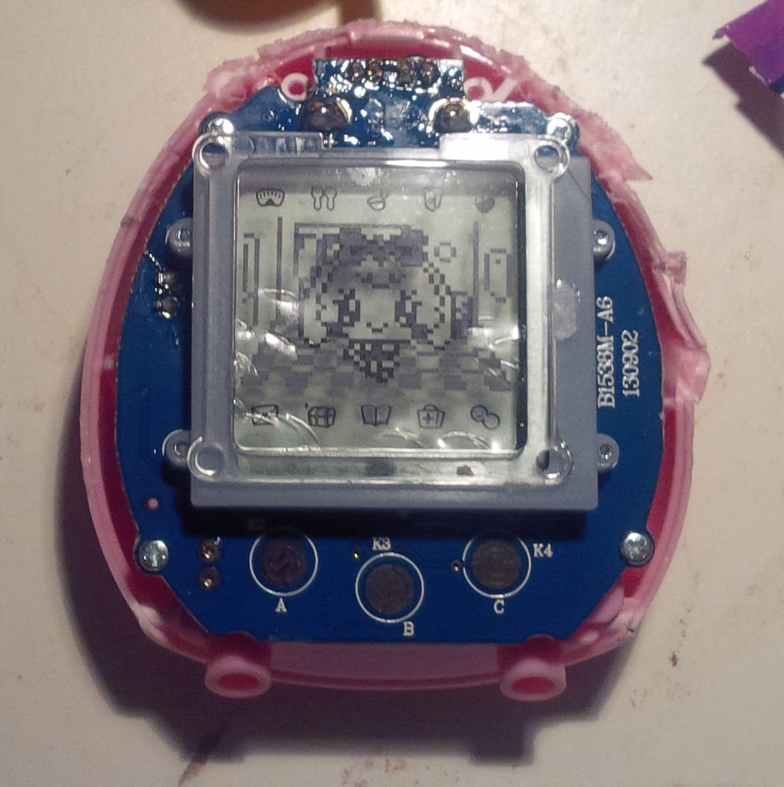
*Tamagotchi Friends front, without plastic case ([source](http://natashenka.ca/tamagotchi-friends-teardown/))*

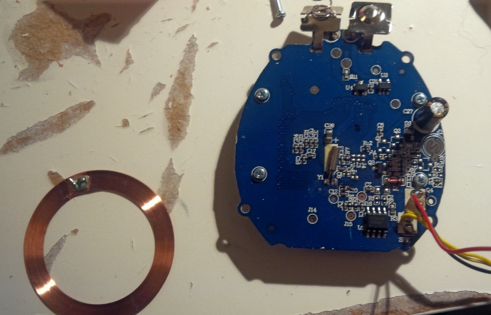
*Tamagotchi Friends board (back) and NFC antenna ([source](http://natashenka.ca/tamagotchi-friends-teardown/))*

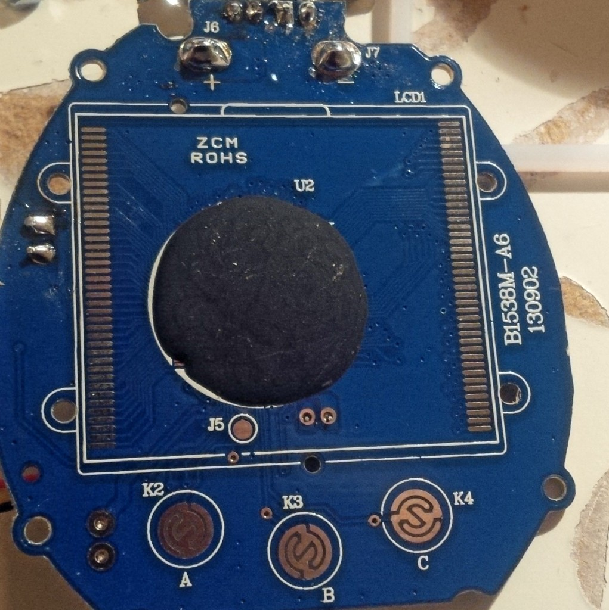
*Tamagotchi Friends board (front) with epoxy ([source](http://natashenka.ca/tamagotchi-friends-teardown/))*

# Japanese series

* [Tamagotchi Plus Color](http://tamagotchi.wikia.com/wiki/Tamagotchi_Plus_Color) and its upgraded version [Hexangontchi](http://tamagotchi.wikia.com/wiki/Hexagontchi)
* [Tamagotchi iD](http://tamagotchi.wikia.com/wiki/Tamagotchi_iD) and [Tamagotchi iD L](http://tamagotchi.wikia.com/wiki/Tamagotchi_iD_L)
* [Tamagotchi Nano](http://tamagotchi.wikia.com/wiki/Tamagotchi_Nano)
* [Tamagotchi P's](http://tamagotchi.wikia.com/wiki/Tamagotchi_P%27s)
  + [MrBlinky](https://twitter.com/mstrblinky) reverse engineered Tamagotchi P's and later released a [firmware patch](http://mrblinky.net/tama/ps/english/) to translate texts from Japanese to English.
  + [MrBlinky](https://twitter.com/mstrblinky) published custom [Virtual Deco Pierces](http://mrblinky.net/tama/vdp/), decorative elements that can be transferred to Tamagotchi via infrared.
* [Tamagotchi 4U](http://tamagotchi.wikia.com/wiki/Tamagotchi_4U) and [Tamagotchi 4U+](http://tamagotchi.wikia.com/wiki/Tamagotchi_4U%2B)
  + Following [MrBlinky](https://twitter.com/mstrblinky) earlier success with Tamagotchi P's, this version was also reverse engineered and a similar [firmware patch](http://mrblinky.net/tama/4u/english/) was made available.
* [Tamagotchi m!x](http://tamagotchi.wikia.com/wiki/Tamagotchi_m!x)

# References

## Sites

* [tamagotchi.wikia.com](http://tamagotchi.wikia.com) The most comprehensive Tamagotchi Wiki to date
* [Wikipedia. List of Tamagotchi releases](https://en.wikipedia.org/wiki/List_of_Tamagotchi_releases)
* [Natalie Silvanovich. Personal Site](http://natashenka.ca)
* [Project TamaShell](http://www.tamashell.com) Complete list of Tamagotchi versions and shells
* [Pixelmood](http://www.tamatalk.com/pixelmood) Tamagotchi fan site, discontinued in 2011. 2 technical articles were published: [Tamagotchi Inside](http://www.tamatalk.com/pixelmood/tamagotchi_inside.htm) and [Tamagotchi Debugging](http://www.tamatalk.com/pixelmood/tamagotchi_connection_debugging.htm)
* [tamenagerie.com](http://www.tamenagerie.com/) Old looking website with plenty of content

## Forums

* [TamaTalk](http://www.tamatalk.com/IB/) _The_ Tamagotchi forum by excellence. As of March 2018, TamaTalk has 94k members and 1,7M posts
* [Tama Zone](http://tama-zone.com/) As of March 2018, Tama Zone has 6k members and 300k posts 

## Projects

* [Natalie Silvanovich's posts at kwartzlab.ca](https://www.kwartzlab.ca/author/natalies) Natalie's published posts between 2009 and 2013. Remarkable milestones: [determining the Tama-Go microcontroller](https://www.kwartzlab.ca/2011/06/tama-go-microcontroller), [executing code](https://www.kwartzlab.ca/2013/05/code-execution-tamagotchi) and [dumping the ROM](https://www.kwartzlab.ca/2013/05/first-glimpse-soul-tamagotchi)
* [spritesmods.com. Creating the Tamagotchi Singularity](http://spritesmods.com/?art=tamasingularity)
* [Waking up Tamagotchi Town - TamaTown. loociano (2018)](http://github.com/loociano/tamatown)

## Talks

* [29c3: Many Tamagotchis Were Harmed in the Making of this Presentation (2012)](https://www.youtube.com/watch?v=c4PkcZScBV8)
* [30c3: Even More Tamagotchis Were Harmed in the Making of this Presentation (2016)](https://www.youtube.com/watch?v=mCt5U5ssbGU) ([slides](https://events.ccc.de/congress/2013/Fahrplan/system/attachments/2195/original/30c3_(1).pdf))
* [Jeroen Domburg Implementing the Tamagotchi Singularity (2015)](https://www.youtube.com/watch?v=3_-e_cJ1-Gs)

## Videos 

* [Erica Griffin. Tamagotchi Take Apart Guide (2009)](https://www.youtube.com/watch?v=ShO4Uam0XKM) Disassembly of a P1 Tamagotchi
* [Pavel Zhovner. Tamagotchi Friends Teardown (2015)](https://www.youtube.com/watch?v=Rm9d0W7wLKk) Disassembling a Tamagotchi Friends

## GitHub repos

* [@natashenka Tamagotchi-Hack](https://github.com/natashenka/Tamagotchi-Hack)
* [@natashenka Egg-Shell - Tamagotchi Development Tools](https://github.com/natashenka/Egg-Shell)
* [@hortinstein Tamagotchi Matrix](https://github.com/hortinstein/tamatrix)
* [@MrBlinky TamaPsTranslation](https://github.com/MrBlinky/TamaPsTranslation) Tamagotchi P's English Translation project
* [@MrBlinky tamadumper](https://github.com/MrBlinky/tamadumper) Tamagotchi P's SPI flash dumper and programmer
* [@loociano Waking up Tamagotchi Town - TamaTown](http://github.com/loociano/tamatown)
* [@asterick Tamago - TamaTown for modern browsers](https://github.com/asterick/tamago) Tamago is a TamaTown Tama-Go web emulator written in JavaScript.

## Datasheets

* [Generalplus. GPLB52640A-52320A-51640A-51320A Version 1.9 (Dec 30, 2010).](http://www.generalplus.com/doc/ds/GPLB52640A-52320A-51640A-51320AV19_ds.pdf)
* [GPLB5x/3x GM03 Library User's Manual Version 2.0 (April 29, 2009)](http://www.lcis.com.tw/paper_store/paper_store/gplb5x_lb3x-GM03%20Libraryv20_user-201471313910398.pdf)

## Patents

* [Nurturing simulation apparatus for virtual creatures. US6213871B1 (1997)](https://patents.google.com/patent/US6213871B1)
* [Game apparatus. USD398659S (1997)](https://patents.google.com/patent/USD398659S)
* [Simulation device for fostering a virtual creature. US5966526A (1997)](https://patents.google.com/patent/US5966526A)
* [Rearing simulation apparatus. US6609968B1 (1997)](https://patents.google.com/patent/US6609968B1)
* [Breeding simulation apparatus for virtual creatures. US7104884B2 (2004)](https://patents.google.com/patent/US7104884B2)
* [Virtual Creature Breeding Simulation System and Information Processing System. US20080096661A1 (2004)](https://patents.google.com/patent/US20080096661A1) 
* [Communication game device. US8545324B2 (2004)](https://patents.google.com/patent/US8545324B2)
* [Game device, control method, and program. US20140066204A1 (2012)](https://patents.google.com/patent/US20140066204)
