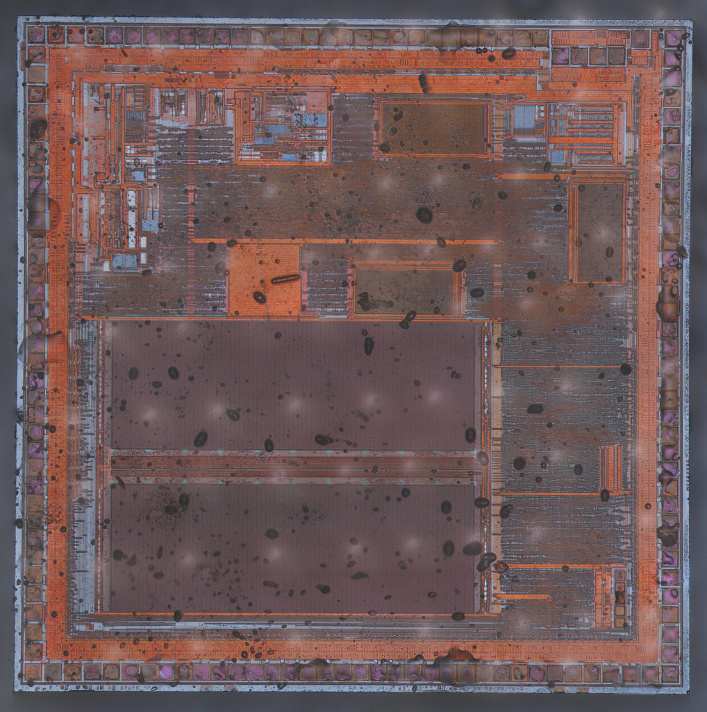
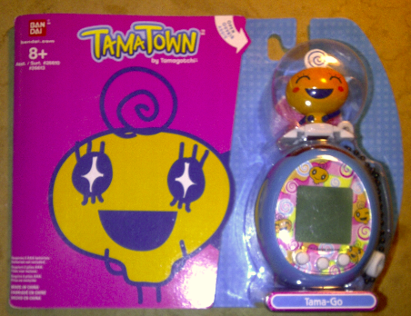

## Introduction

[tamagotch.org](http://tamagotch.org) aims at documenting the technical specifications of Tamagotchi toys, with focus on worldwide releases. This project is inspired by [this talk](https://www.youtube.com/watch?v=c4PkcZScBV8) by [Natalie Silvanovich](http://natashenka.ca) and her further work on Tamagotchis.

Check out the [GitHub repo](https://github.com/loociano/tamagotch) to contribute or report a broken link.

## Original Series

* Versions: [P1 and P2](http://tamagotchi.wikia.com/wiki/Tamagotchi_(1996_Pet)), [Angel](http://tamagotchi.wikia.com/wiki/Tamagotchi_Angel) and [Ocean](http://tamagotchi.wikia.com/wiki/Tamagotchi_Ocean) 
* Release Dates: 1996-1998

### Disassembly 


*Tamagotchi P1 disassembly ([Source](https://artplusmarketing.com/another-icons-teardown-tamagotchi-original-322dc8ed188d))*

## Connection Series

* Versions: [V1](http://tamagotchi.wikia.com/wiki/Tamagotchi_Connection_Version_1), [V2](http://tamagotchi.wikia.com/wiki/Tamagotchi_Connection_Version_2), [Mini](http://tamagotchi.wikia.com/wiki/Tamagotchi_Mini), [V3](http://tamagotchi.wikia.com/wiki/Tamagotchi_Connection_Version_3), [V4](http://tamagotchi.wikia.com/wiki/Tamagotchi_Connection_Version_4), [V4.5](http://tamagotchi.wikia.com/wiki/Tamagotchi_Connection_Version_4.5), [V5](http://tamagotchi.wikia.com/wiki/Tamagotchi_Connection_Version_5), [V5.5 (Celebrity)](http://tamagotchi.wikia.com/wiki/Tamagotchi_Connection_Version_5_Celebrity) and [V6 (Music Star)](http://tamagotchi.wikia.com/wiki/Tamagotchi_Music_Star).
* Release Dates: 2004-2009

## Mini

Mini was released in 2005 and re-launched worldwide in 2017.

* [Official Page (Japanese)](http://tamagotch.channel.or.jp/tamagotchi/mini)
* [Tamagotchi Wiki entry](http://tamagotchi.wikia.com/wiki/Tamagotchi_Mini)

### Tech Specs

* CPU: ?
* Memory: ?
* IO: 3 buttons, 16x16 pixel screen

### Disassembly

<p class="half-sized">
  
  
  
  
</p>

## TamaTown Tama-Go

[TamaTown Tama-Go](http://tamagotchi.wikia.com/wiki/TamaTown_Tama-Go) was released in 2010 and reverse engineered by [Natalie Silvanovich](http://natashenka.ca).

### Tech Specs

* CPU: 8-bit CMOS GPLB52320A ([datasheet](http://www.generalplus.com/doc/ds/GPLB52640A-52320A-51640A-51320AV19_ds.pdf)) with 2x 16-bit timers.
* RAM: 1,536 bytes
* ROM: 320K bytes = 10 banks of 32K ([dump](https://github.com/natashenka/Tamagotchi-Hack/tree/master/codedump/rompages), [GP Test Program](https://github.com/natashenka/Tamagotchi-Hack/blob/master/codedump/GPTestProgram))
* IO: 16 ports PA[7:0], PB[7:0]
  * Serial Peripheral Interface (SPI)
  * Display Controller: 4 levels of gray with 512 bytes of dedicated RAM. 64 segments and 32 commons = 2048 pixels
* Sound Processing Unit (SPU)


*GPLB52320A schematic and actual chip*

Tama-Go Figure

* ROM: GPR26LXXXX (8MB or 16MB)

### Memory Map

```
$0000-$0600 SPU RAM, GP RAM
$0600-$0FFF -
$1000-$1FFF DPRAM (VRAM)
$2000-$2FFF -
$3000-$3FFF IO Reg
$4000-$7FFF ROM bank (lower)
$8000-$BFFF ROM bank (high)
$C000-$CBBF SPU table, test program
$CBC0-$CBFF Test Interrupt Vector
$CC00-$FFBF ROM (33C0 bytes)
$FFC0-$FFEF Interrupt Vector
$FFF0-$FFF9 -
$FFFA-$FFFD NMI and reset vector
$FFFE-$FFFF -
```

### Disassembly

Source: [Tama-Town Tamago Teardown. Natalie Silvanovich](https://www.kwartzlab.ca/2010/11/tama-town-tamago-teardown)


*TamaTown Tamago packaging*


*TamaTown board*


*TamaTown Tama-Go board, back side*


*TamaTown Tama-Go top board, for figure*


*TamaTown figure board with epoxy*

## Friends Series

* Versions: [Tamagotchi Friends](http://tamagotchi.wikia.com/wiki/Tamagotchi_Friends) and [Tamagotchi Friends: Dream Town](http://tamagotchi.wikia.com/wiki/Tamagotchi_Friends:_Dream_Town_Digital_Friend)
* Release dates: 2014-2016

### Disassembly

Source: [Tamagotchi Friends Teardown. Natalie Silvanovich (2013)](http://natashenka.ca/tamagotchi-friends-teardown/)


*Tamagotchi Friends*


*Tamagotchi Friends front, without plastic case*


*Tamagotchi Friends board (back) and NFC antenna*


*Tamagotchi Friends board (front) with epoxy*

## References

### Sites

* [tamagotchi.wikia.com](http://tamagotchi.wikia.com) The most comprehensive Tamagotchi Wiki to date
* [TamaTalk](http://www.tamatalk.com/IB/) _The_ Tamagotchi forum by excellence 
* [Wikipedia. List of Tamagotchi releases](https://en.wikipedia.org/wiki/List_of_Tamagotchi_releases)
* [Natalie Silvanovich. Personal Site](http://natashenka.ca)
* [kwartzlab. Natalie Silvanovich posts](https://www.kwartzlab.ca/author/natalies)
* [spritesmods.com. Creating the Tamagotchi Singularity](http://spritesmods.com/?art=tamasingularity)
* [Project TamaShell](http://www.tamashell.com) Complete list of Tamagotchi versions and shells

### Presentations

* [29c3: Many Tamagotchis Were Harmed in the Making of this Presentation](https://www.youtube.com/watch?v=c4PkcZScBV8)
* [30c3: Even More Tamagotchis Were Harmed in the Making of this Presentation](https://www.youtube.com/watch?v=mCt5U5ssbGU) ([slides](https://events.ccc.de/congress/2013/Fahrplan/system/attachments/2195/original/30c3_(1).pdf))

### Videos 

* [Erica Griffin. Tamagotchi Take Apart Guide](https://www.youtube.com/watch?v=ShO4Uam0XKM) Disassembly of an Original Tamagotchi (P1/P2 version). 2009.

### GitHub repos

* [@natashenka Tamagotchi-Hack](https://github.com/natashenka/Tamagotchi-Hack)
* [@natashenka Egg-Shell - Tamagotchi Development Tools](https://github.com/natashenka/Egg-Shell)
* [@hortinstein Tamagotchi Matrix](https://github.com/hortinstein/tamatrix)

### Datasheets

* [Generalplus. GPLB52640A-52320A-51640A-51320A Version 1.9 (Dec 30, 2010).](http://www.generalplus.com/doc/ds/GPLB52640A-52320A-51640A-51320AV19_ds.pdf)
* [GPLB5x/3x GM03 Library User's Manual Version 2.0 (April 29, 2009)](http://www.lcis.com.tw/paper_store/paper_store/gplb5x_lb3x-GM03%20Libraryv20_user-201471313910398.pdf)

### Patents

* [Simulation device for fostering a virtual creature. US5966526A (1999)](https://patents.google.com/patent/US5966526A)
* [Nurturing simulation apparatus for virtual creatures. US6213871B1 (2001)](https://patents.google.com/patent/US6213871B1)
* [Breeding simulation apparatus for virtual creatures. US7104884B2 (2006)](https://patents.google.com/patent/US7104884B2)
* [Communication game device. US8545324B2 (2013)](https://patents.google.com/patent/US8545324B2/en)
* [Game device, control method, and program. US20140066204A1 (2014)](https://patents.google.com/patent/US20140066204)